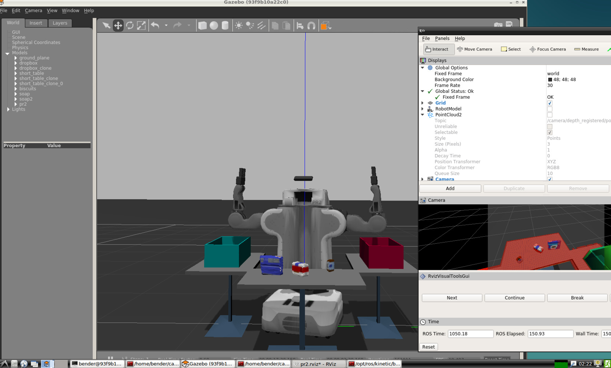

# udacity-robond

Creates a Docker image with all the prerequisites needed to run the projects of the [Udacity Robotics Nanodegree](https://www.udacity.com/robotics).

This image is based on the [dev-machine image](https://github.com/yrahal/dev-machine), and extends it by
adding ROS Kinetic, sympy, cython and other dependencies needed to run labs and projects as instructed in
the nanodegree.

This image can be launched in CLI mode or in UI mode via a TurboVNC server that you can connect to. Or
in a variety of other situations. It supports 3D acceleration if you have Nvidia hardware or, like in my case,
if you run it on GPU instances on AWS. See my [ec2-setup GitHub repo](https://github.com/yrahal/ec2-setup)
for instructions on how to easily setup a GPU instance on AWS to run ROS and Gazebo. You can still run it on
non Nvidia hardware, but depending on your setup, performance will be degraded.

You can also refer to the instructions from the
[`dev-machine` repository](https://github.com/yrahal/dev-machine/blob/master/README.md) for extra information on
usage. The notable differences is that `yrahal/dev-machine` must be replaced by `yrahal/udacity-robond`
and that the default user in `yrahal/udacity-robond` is... `bender`.

You might also find this
[Medium post](https://medium.com/@YoucefRahal/3d-accelerated-docker-image-for-the-udacity-robotics-nanodegree-3095a264144)
and this [YouTube video](https://youtu.be/389nucLb7ZE) useful.

## Files
* `run.sh`: Script provided for convenience to run the image with some useful mappings:
  * Runs the image with a TurboVNC server and maps the container's `5901` port to the same one on
  the host.
  * Maps the current directory on the host to `/src` on the container (which is the default working
  directory).
  * Maps the Docker volume `bender-home` to the `bender` home directory on the container. This volume
  exists on the host and is created on the first run. This is useful to persist the preferences
  between sessions, but is not required.
* `run_nvidia.sh`: Another script provided for convenience, which is useful to run when connected through VNC
to a GPU instance that has been properly set up to use the hardware. This script launches a container with
a bash shell with `vglrun` so that you can directly launch 3D apps such as Gazebo from it. You can use it as
a starting point to work on your robotics projects.
* `build.sh`: Script to build the image from the `Dockerfile`.
* `Dockerfile`: File used to build the image. This image is hosted on Docker Hub as
[`yrahal/udacity-robond`](https://hub.docker.com/r/yrahal/udacity-robond).
